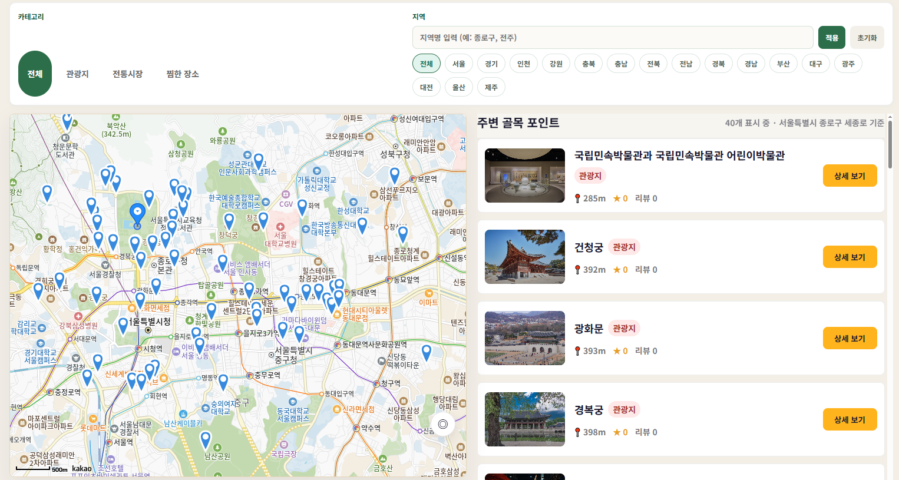
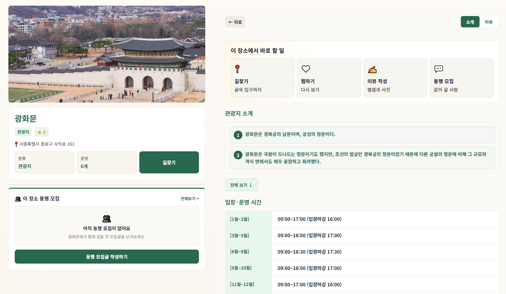
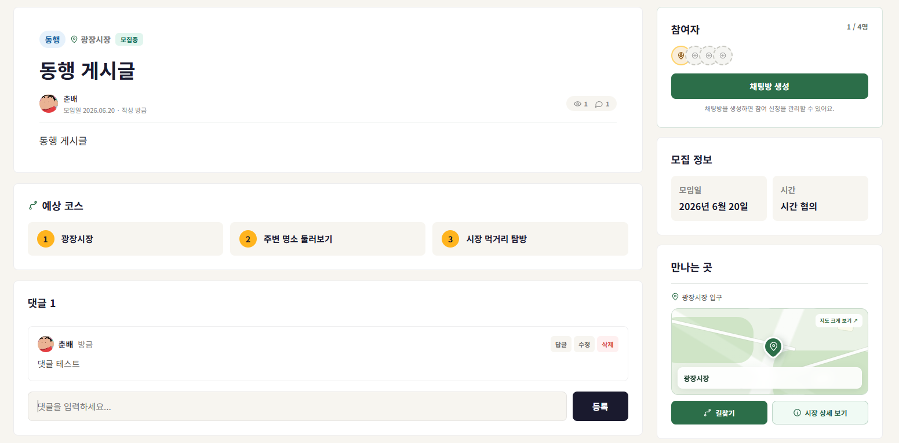
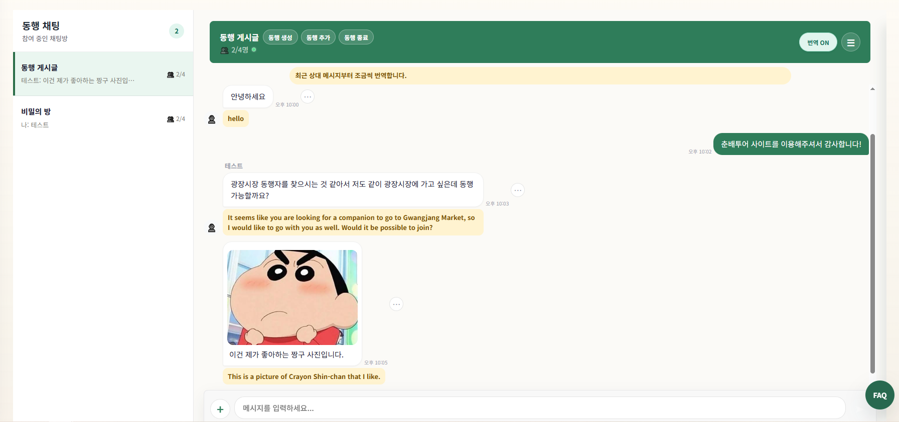

# 춘배투어 (Chunbae Tour) — Frontend

> 전국 관광·커뮤니티·결제를 하나로 묶은 React 기반 모바일 PWA

## 목차

- [📸 스크린샷](#-스크린샷)
- [📝 프로젝트 노트](#-프로젝트-노트)
- [📌 한눈에 보기](#-한눈에-보기)
- [✨ 주요 기능](#-주요-기능)
- [🛠 기술 스택](#-기술-스택)
- [🧱 아키텍처](#-아키텍처)
- [🚀 실행 방법](#-실행-방법)
- [🔑 환경 변수](#-환경-변수)
- [📐 개발 규칙](#-개발-규칙)
- [📚 관련 문서](#-관련-문서)

---

장소 탐색부터 길찾기, 동행 모집, 축제 정보, QR 결제, 상인 가게 관리까지 — 여행객과 지역 상인을 잇는 모바일 우선(mobile-first) 서비스입니다.

---

## 📸 스크린샷

| 지도·장소 탐색 | 장소 상세 |
|---|---|
|  |  |

| 동행 게시글 | 동행 채팅 |
|---|---|
|  |  |

---

## 📝 프로젝트 노트

**백엔드 개발자 관점에서 직접 구현**한 프론트엔드입니다. 프론트 전문 경험이 깊진 않지만, 팀원들과 제가 설계한 백엔드 API에 맞춰 화면·연동 구조를 설계하고 AI 페어 프로그래밍(바이브 코딩)으로 구현을 가속했습니다. API 계약·결제 흐름·실시간 통신 등 핵심 설계 판단은 직접 내렸습니다.

양쪽을 함께 만들어 보며, **"이 로직을 프론트에서 처리할지 백엔드에서 처리할지"** 가 실무에서 의견 충돌이 잦은 지점임을 체감했습니다. 프론트 관점에서 작업하다 보니 백엔드 요구를 수용하며 개발하는 일이 결코 단순하지 않다는 것도 알게 됐고, 그때마다 책임 경계를 어디에 둘지 직접 따져 결정했습니다. 이 경험으로 **양 끝단을 모두 이해한 상태에서 소통하는 감각**을 길렀습니다.

---

## 📌 한눈에 보기

| 항목 | 내용 |
| --- | --- |
| 서비스 URL | https://chunbae-tour.site |
| API 서버 | https://api.chunbae-tour.site |
| 플랫폼 | 모바일 우선 PWA (홈 화면 설치 지원) |
| 핵심 연동 | Kakao Map · PortOne 결제 · WebSocket(STOMP) 실시간 |

---

## ✨ 주요 기능

- **장소·지도 탐색** — Kakao Map 기반 장소 검색, 상세 정보, 카테고리 필터
- **길찾기** — 출발지/도착지 경로 안내 및 카카오맵 연동
- **동행 모집 커뮤니티** — 게시글 작성, 동행 신청, 후기·리뷰
- **실시간 채팅** — STOMP + SockJS 기반 그룹 채팅 및 알림 푸시
- **축제 정보** — 달력형 일정 조회 및 축제 상세
- **QR 결제 / 엽전 충전** — 충전은 PortOne SDK로 프론트에서 결제창 호출, 가게 QR 결제는 백엔드 주도 처리
- **상인 가게 관리** — 입점 신청, 가게·상품 관리, 결제 내역
- **관리자 콘텐츠 관리** — 장소·축제·신고·결제 운영 기능

---

## 🛠 기술 스택

**Environment**


**Config**


**Development**


-010101?logo=socketdotio&logoColor=white)


**Quality**


---

## 🧱 아키텍처

- **화면 기반 라우팅** — [src/App.jsx](src/App.jsx)의 문자열 `screen` 상태로 화면을 전환합니다. (별도 라우터 라이브러리 미사용)
- **서비스 레이어 분리** — 모든 백엔드 호출은 [src/services/](src/services/)의 도메인별 모듈(24개)을 통해 이뤄지며, [apiClient.js](src/services/apiClient.js)가 공통 요청·인증·에러 처리를 담당합니다.
- **점진적 API 교체** — 기존 mock UI를 유지한 채 실제 API 연동으로 단계적으로 전환하는 구조입니다. API 명세에 없는 필드는 임의로 추측하지 않습니다.
- **결제 이원화** — 엽전 충전은 PortOne SDK로 프론트에서 결제창을 호출하고, 가게 QR 결제는 백엔드 주도로 처리합니다. 결제 수단별 흐름을 분리했습니다.
- **PWA 채택** — 1달 프로젝트 일정상 앱 스토어 심사 기간·비용이 현실적으로 불가했습니다. 서비스 실용성이 검증되면 네이티브 앱으로 전환할 수 있도록 확장 가능성을 열어뒀습니다.
- **인증 토큰** — MVP 기준 `sessionStorage`에 저장합니다.

```txt
chunbae-frontend/
├── public/                  정적 파일 (PWA 아이콘, manifest, service worker)
├── src/
│   ├── App.jsx              screen 상태 기반 라우팅 진입점
│   ├── assets/              이미지·SVG 등 정적 에셋
│   │   └── brand/           마스코트·엽전 아이콘 등 브랜드 에셋
│   ├── components/          공통 컴포넌트
│   │   ├── auth/            인증 관련 UI (마스코트 등)
│   │   ├── common/          앱 셸, 탭바, 공용 UI
│   │   └── map/             카카오맵 래퍼
│   ├── constants/           색상 토큰, 이미지 매핑, 카테고리 상수
│   ├── pages/               화면 단위 컴포넌트 (도메인별 폴더)
│   │   ├── admin/           관리자 화면
│   │   ├── auth/            로그인·회원가입·약관
│   │   ├── chat/            채팅 목록·채팅방
│   │   ├── community/       동행 모집 커뮤니티
│   │   ├── festival/        축제 캘린더·상세
│   │   ├── home/            홈 (로그인 전·후)
│   │   ├── map/             지도·장소 상세·길찾기
│   │   ├── merchant/        상인 입점 신청·가게 관리
│   │   ├── misc/            기타 (알림, 설정 등)
│   │   ├── my/              마이페이지·보유 아이템
│   │   ├── payment/         결제·충전·내역
│   │   ├── store/           스토어 (상품 구매)
│   │   └── support/         고객센터
│   ├── services/            도메인별 API 연동 모듈 (24개)
│   │   └── apiClient.js     공통 요청·인증·에러 처리
│   ├── styles/              전역 스타일·PWA 셸 CSS
│   └── utils/               공용 유틸 (지오코딩, QR, 날짜 등)
├── docs/
│   ├── api-spec.json        백엔드 API 명세 (OpenAPI)
│   └── frontend/            프론트 연동 기준 문서
├── tests/e2e/               Playwright E2E 테스트
└── index.html               Vite 진입점
```

---

## 🚀 실행 방법

> 이미 배포되어 있어도 로컬 실행은 버그 재현·검수·재방문 시 생명줄입니다.

```bash
# 의존성 설치
pnpm install

# 개발 서버
pnpm dev
```

npm을 쓴다면:

```bash
npm install
npm run dev
```

### 그 외 스크립트

| 명령 | 설명 |
| --- | --- |
| `pnpm dev` | 로컬 개발 서버 |
| `pnpm dev:mobile` | 모바일 실기기 테스트용 (`--host`, HTTPS) |
| `pnpm build` | 프로덕션 빌드 |
| `pnpm preview` | 빌드 결과 미리보기 |
| `pnpm lint` | ESLint 검사 |
| `pnpm test:e2e` | Playwright E2E 테스트 |

---

## 🔑 환경 변수

프로젝트 루트에 `.env` 파일을 생성합니다.

```bash
VITE_API_BASE_URL=        # 백엔드 API 베이스 URL
VITE_KAKAO_MAP_JS_KEY=    # Kakao Map JavaScript 키
```

> 결제 관련 민감 값은 백엔드 응답으로 전달받는 구조입니다. PortOne secret 등은 프론트 `.env`에 넣지 않습니다.

---

## 📐 개발 규칙

- 화면 전환은 [src/App.jsx](src/App.jsx)의 문자열 `screen` 상태를 기준으로 합니다.
- 기존 mock UI를 유지하며 API 연동을 점진적으로 교체합니다.
- API 명세에 없는 필드는 임의로 추측하지 않습니다.
- 인증 토큰은 MVP 기준 `sessionStorage`에 저장합니다.

---

## 📚 관련 문서

- OpenAPI 명세: [docs/api-spec.json](docs/api-spec.json)
- 프론트 연동 기준: [docs/frontend/api-contract.md](docs/frontend/api-contract.md)
- 화면-API 매핑: [docs/frontend/screen-map.md](docs/frontend/screen-map.md)
